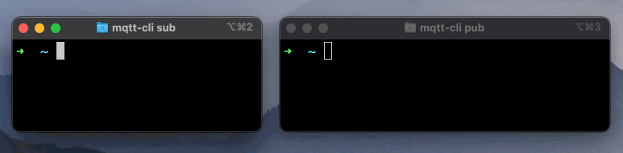
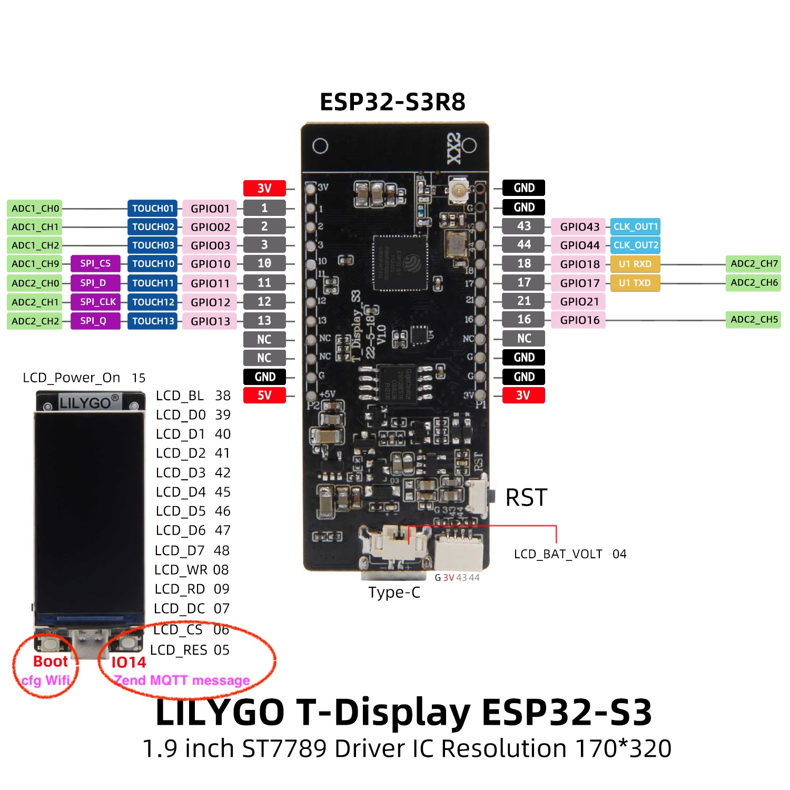

<h1 align = "center"> 🌟T-Display-S3 with MQTT🌟</h1>

[](https://github.com/Xinyuan-LilyGO/T-Display-S3/actions/workflows/platformio.yml)

## MQTT on T-Display S3 - HiveMQ and TkkrLab

This is a project targeted at educating the ‘maker community’ on how to use the MQTT protocol for bidirectional communication with the ESP32 to publish messages and subscribe to topics. The code and underlying setup also can also be used as a boilerplate for more professional solutions since it is robust and compatible with a range of hardware systems.

https://www.hivemq.com/article/iot-tutorial-bidirectional-mqtt-communication-esp32/


## Description

T-Display-S3 is a ESP32-S3 development board. It is equipped with a color 1.9" LCD screen and two programmable buttons. Communication using I8080 interface. Retains the same layout design as T-Display. You can directly use ESP32S3 for USB communication or programming.

## MQTT

MQTT is a lightweight, publish-subscribe, machine to machine network protocol for message queue/message queuing service. It is designed for connections with remote locations that have devices with resource constraints or limited network bandwidth, such as in the Internet of Things.




## Usefull links

* https://code.visualstudio.com/download
* https://github.com/hivemq/mqtt-cli/releases/download/v4.22.0/mqtt-cli-4.22.0-win.zip
* https://hivemq.github.io/mqtt-cli/
* https://mqttx.app/downloads


## T-Display-S3 Pinout



to reset to factory empty:
 ``` python -m esptool --chip esp32-s3 erase_flash ```

## Where to buy

T-Display-S3 is available from: [LILYGO](https://www.lilygo.cc/products/t-display-s3), [Amazon](https://www.amazon.com/dp/B0B7X5RVTH?ref=myi_title_dp) and [Aliexpress](https://www.aliexpress.com/item/3256804310228562.html).

## Quick Start

### Arduino

**Please use Arduino ESP32 version below 3.0. There are too many changes in version 3.0 and it has not been updated yet.**

1. In Arduino Preferences, on the Settings tab, enter the `https://raw.githubusercontent.com/espressif/arduino-esp32/gh-pages/package_esp32_index.json` URL in the `Additional boards manager URLs` input box. 
2. Click OK and the software will install. 
3. Search for ESP32 in Tools → Board Manager and install `esp32` (Arduino-ESP32)
4. Copy everything from this repository lib folder to [Arduino library folder](https://docs.arduino.cc/software/ide-v1/tutorials/installing-libraries#manual-installation) (e.g. `C:\Users\YourName\Documents\Arduino\libraries`)
5. Select the correct settings in the Tools menu as shown below.

| Setting                  | Value                            |
| :----------------------- | :------------------------------- |
| USB CDC On Boot          | Enabled                          |
| CPU Frequency            | 240MHz (WiFi)                    |
| Core Debug Level         | None                             |
| USB DFU On Boot          | Enabled                          |
| Events Run On            | Core 1                           |
| Flash Mode               | QIO 80MHz                        |
| Flash Size               | 16MB (128Mb)                     |
| JTAG Adapter             | Integrated USB JTAG              |
| Arduino Runs On          | Core 1                           |
| USB Firmware MSC On Boot | Disabled                         |
| Partition Scheme         | Huge APP (3MB No OTA/1MB SPIFFS) |
| PSRAM                    | OPI PSRAM                        |
| USB Mode                 | Hardware CDC and JTAG            |

### PlatformIO

1. Install [VisualStudioCode](https://code.visualstudio.com/) and [Python](https://www.python.org/)
2. Search for the `PlatformIO` plugin in the `VisualStudioCode` extension and install it.
3. After the installation is complete, you need to restart `VisualStudioCode`
4. After restarting `VisualStudioCode`, select `File` in the upper left corner of `VisualStudioCode` -> `Open Folder` -> select the `T-Display-S3` directory
5. Click on the `platformio.ini` file, and in the `platformio` column, cancel the sample line that needs to be used, please make sure that only one line is valid
6. Click the (✔) symbol in the lower left corner to compile
7. Connect the board to the computer USB
8. Click (→) to upload firmware
9. Click (plug symbol) to monitor serial output


### Micropython

- [russhughes/st7789s3_mpy](https://github.com/russhughes/st7789s3_mpy)
- [Micropython](https://github.com/Xinyuan-LilyGO/lilygo-micropython)


## FAQ

1. The program can be written normally, but there is still no display after writing
   1. There are factory test files in the firmware folder, which can be flashed into the board to check whether the board is normal. If there is still no display, then it can be judged that there is a problem with the board or the screen
   2. Delete the <TFT_eSPI> in the libraries, and replace the <TFT_eSPI> in the <lib> folder of the main page to the libraries directory
   3. When opening the Arduino IDE, it prompts whether to upgrade the library, please choose not to upgrade, otherwise it will overwrite the configuration of the <TFT_eSPI> display

